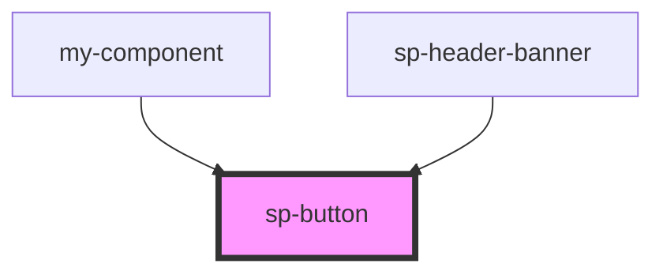

# sp-button

<!-- Auto Generated Below -->

## Properties

| Property        | Attribute         | Description | Type     | Default              |
| --------------- | ----------------- | ----------- | -------- | -------------------- |
| `kind`          | `kind`            |             | `string` | `"Primary"`          |
| `onButtonClick` | `on-button-click` |             | `any`    | `undefined`          |
| `text`          | `text`            |             | `string` | `"This is a button"` |

## Dependencies

### Used by

 - [my-component](../../../my-component)
 - [sp-header-banner](../../Text/sp-header-banner)

### Graph

----------------------------------------------

*Built with [StencilJS](https://stenciljs.com/)*
